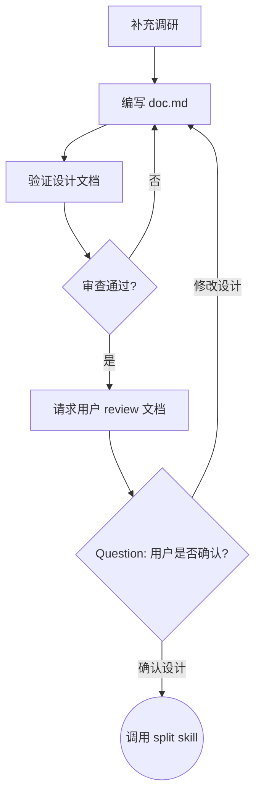

## 目标

基于已澄清的需求和代码库调研上下文，编写正式设计文档 `.comate/specs/{feature_name}/doc.md`。

`design` 只解决方案不确定性，不创建 iCafe 卡片，不生成实施计划，不编写代码。

## 流程

使用 TodoWrite 工具为下面列表项创建 TODO，并按顺序完成：

1. 补充调研
2. 编写 `doc.md`
3. 派发 reviewer 验证设计文档
4. 请求用户 review 文档

### 补充调研

基于上游上下文补充调研，而不是重复完整 `think`。

并行派发两个子 agent：

| 子 agent | Prompt                         | 输入                     | 要求                                   |
| -------- | ------------------------------ | ------------------------ | -------------------------------------- |
| deepwiki | `references/deepwiki-agent.md` | 需求、技术栈、关注模块   | 补充架构文档、约束、模块关系           |
| explore  | `references/explore-agent.md`  | 需求、已知相关文件和目录 | 从已知路径深挖代码结构、调用链和数据流 |

如果上游已经提供相关路径，`explore` 子 agent 必须从已知路径深挖，不做无关全仓扫描。

### 编写 `doc.md`

将 `think` 上下文、iCafe 上下文和两个子 agent 报告合并，写入：

```text
.comate/specs/{feature_name}/doc.md
```

文档必须覆盖：

- 背景和目标
- 当前代码库现状
- 架构和技术设计
- 数据流或调用链
- 关键接口、数据结构或模块边界
- 错误处理、兼容性和边界情况
- 测试策略
- 明确不做的内容

### 验证设计文档

写完 `doc.md` 后，使用 `references/design-document-reviewer-prompt.md` 派发 subagent 审查。

如果审查发现会影响后续拆卡或实现的问题，修复 `doc.md` 并重新审查，直到通过。

### 请求用户 review 文档

审查通过后，必须使用 question 工具请求用户 review 文档：

```text
设计文档已编写至 `.comate/specs/{feature_name}/doc.md`。请您审阅，如果需要调整，请告诉我。
```

问题必须包含两个选项：

- 确认设计：进入 `split`
- 修改设计：根据用户意见修改 `doc.md`，并重新自审

## 状态机



## 文档风格

1. 架构和数据流优先使用 mermaid 图，不使用 ASCII 图。
2. 不写完整实现代码，只保留关键签名、数据结构或配置示例。
3. 避免无信息量的 markdown 语法，例如水平分割线。
4. 严格 YAGNI，不加入用户没有要求且设计不需要的能力。
