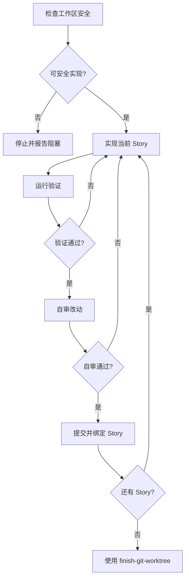

## 目标

基于 `split` 已创建并经用户确认的 Story 直接实现需求

> [!IMPORTANT]
> 用户已经选择跳过 `plan`，因此不要反向补写实施计划。只有在 Story 边界或需求本身无法支撑实现时才停止并请求用户回到 `split` 或 `plan`。

## 流程

使用 TodoWrite 工具为下面列表项创建 TODO，并按顺序完成：

1. 检查工作区安全
2. 直接实现 Story
3. 运行验证
4. 自审改动
5. 提交并绑定 Story

全部 Story 完成后，使用 `finish-git-worktree` skill 收尾。

### 检查工作区安全

开始修改前读取当前工作区状态：

```bash
git status --short --branch -uall
```

把已修改、已暂存和未跟踪文件视为用户工作。可以读取并纳入判断，但不要移动、覆盖、清理、丢弃或隐藏这些文件，除非用户在当前轮明确批准。

如果当前分支是 `main` 或 `master`，且用户没有明确允许在主分支实现，先使用 `using-git-worktrees` skill 创建隔离 worktree。

### 直接实现 Story

实现输入来自 `think` / `design` / `split` 的当前上下文，尤其是已创建的 Story 卡片。每个 Story 都是一个实现单元和提交绑定单位。不要绑定 Feature 或 Story 下 Task。

如果上下文里没有 Story 卡片信息，先停止并说明缺少提交绑定单位；不要自行跳过绑定策略。

按 Story 顺序实现。每个 Story 开始前，确认：

1. 目标和验收口径
2. 范围内和范围外
3. 关注文件与目录
4. 必要的验证方式

实现时只改当前 Story 所需内容。不要借机重构无关代码，不要拆出新的 Story 或补写 `tasks.md`。

### 运行验证

在声明完成、提交或进入下一个 Story 前，必须有本轮新鲜验证证据。

验证顺序：

1. 优先运行 Story、项目文档或现有脚本指定的命令
2. 如果没有明确命令，从项目上下文中选择最小可信验证命令
3. 运行完整命令，阅读完整输出和退出码
4. 如果命令不可运行，说明原因并执行可替代验证

不要使用 “should / probably / seems” 声称完成。

### 自审改动

每个 Story 验证后，自审：

1. 是否满足 Story 目标和验收口径
2. 是否存在范围漂移或无关重构
3. 是否符合现有代码模式
4. 是否引入未知标识符、依赖、生成物漂移或明显安全风险
5. 是否只包含当前 Story 应有改动

发现问题先修复并重新验证。

### 提交并绑定 Story

每个 Story 完成后，如需要提交，提交只包含当前 Story 的相关改动，并绑定该 Story 卡片。

提交前再次确认：

1. 工作区中没有混入其他 Story 或用户无关改动
2. 验证命令已在当前轮运行并通过，或替代验证已说明
3. 提交绑定的是 Story，不是 Feature 或 Story 下 Task

## 状态机



## 禁止事项

绝不要：

- 跳过 Story 绑定策略
- 在跳过 `plan` 后反向补写 `tasks.md`
- 把 Feature 或 Story 下 Task 作为提交绑定单位
- 在主分支上擅自实现
- 覆盖、清理或丢弃用户已有改动
- 在没有新鲜验证证据时声称完成
- 为了实现当前 Story 做无关重构或跨 Story 改动
