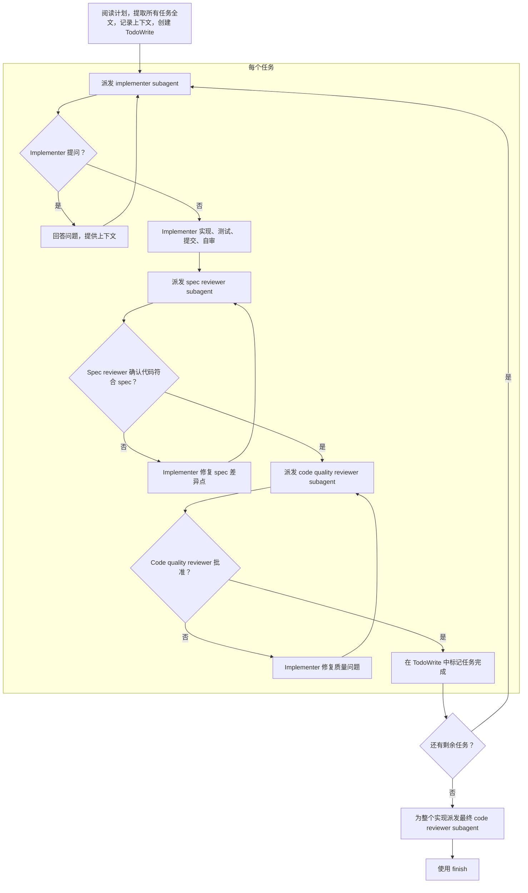

## 目标

通过为每个 task 派发新的 subagent 来忠实的执行计划文档（`tasks.md`）

> [!NOTE] 为什么使用 subagent：
>  你将任务委托给具有隔离上下文的专用 agent。通过精确构造它们的指令和上下文，可以确保它们保持专注并完成任务。它们不应继承你当前会话的上下文或历史；你只构造它们确实需要的内容。这也会保留你自己的上下文，用于协调工作。

> [!IMPORTANT]
> 不要在任务进行中暂停并向用户确认。你需要不中断地执行计划中的所有任务。唯一应该停止的原因是：出现你无法解决的 BLOCKED 状态、存在真正阻止推进的歧义，或所有任务都已完成。“我应该继续吗？”这类提示和进度摘要会浪费他们的时间；他们要求你执行计划，所以执行它。

## 流程

对每个任务，按顺序派发三个独立的 subagent：
1. **Implementer：** 实现任务契约、测试、提交、自审、报告状态。
2. **Spec compliance reviewer：** 验证结果是否满足任务目标、范围、验收标准和约束。
3. **Code quality reviewer：** 仅在 spec compliance 通过后审查代码质量。

implementer 的自审不是 review 阶段。code quality reviewer 不能替代 spec compliance reviewer。



## 处理 Implementer 状态

Implementer subagent 会报告四种状态之一。请分别妥善处理：

**DONE：** 进入 spec compliance review。

**DONE_WITH_CONCERNS：** implementer 完成了工作，但标记了疑虑。继续前先阅读这些疑虑。如果疑虑涉及正确性或范围，先解决后再 review。如果只是观察项（例如“这个文件正在变大”），记录下来并继续 review。

**NEEDS_CONTEXT：** implementer 需要尚未提供的信息。补充缺失上下文并 resume 该 subagent。

**BLOCKED：** implementer 无法完成任务。评估阻塞原因：
1. 如果是上下文问题，提供更多上下文并重新派发
2. 如果任务过大，将其拆分成更小的部分
3. 如果计划本身有误，报告给人类处理

不要在没有任何改变的情况下强迫 subagent 重试。如果 implementer 表示卡住了，就必须做出某种调整。

## Prompt 模板

- `./implementer-prompt.md` - 派发 implementer subagent
- `./spec-reviewer-prompt.md` - 派发 spec compliance reviewer subagent
- `./code-quality-reviewer-prompt.md` - 派发 code quality reviewer subagent

## 示例工作流

```
You: 我正在使用 execute-task-plan skill 执行此计划。

[读取一次计划：.comate/specs/{feature_name}/tasks.md]
[提取每个任务的目标、范围、上下文、文件、验收标准、约束和验证方式]
[使用所有任务创建 TodoWrite]

Task 1: [Task title]

[使用 Task 1 文本 + 相关 spec 上下文派发 implementer subagent]
Implementer: DONE / DONE_WITH_CONCERNS / NEEDS_CONTEXT / BLOCKED

如果 NEEDS_CONTEXT: 提供上下文并重新派发
如果 BLOCKED: 解决阻塞、拆分任务，或升级给人类
如果 DONE_WITH_CONCERNS: review 前阅读疑虑

如果 DONE 或疑虑已解决：
[派发 spec compliance reviewer]
如果 spec reviewer 发现问题：将问题返回给 implementer，然后重新运行 spec review

spec 批准后：
[派发 code quality reviewer]
如果 code quality reviewer 发现问题：将问题返回给 implementer，然后重新运行 code quality review

[仅在两个 review 都批准后标记 Task 1 完成]

...

[所有任务完成后]
[为整个实现派发最终 code reviewer]
[使用 finish]
```

## 禁止事项

绝不要：
- 未经用户明确同意就在 main/master 分支上开始实现；使用 `using-git-worktrees` skill 创建隔离的 worktree
- 对可能触碰相同文件的任务并行派发多个 implementation subagent
- 让 subagent 自己读取整个 plan 文档；请提供精确的任务文本和相关上下文
- 跳过背景上下文；subagent 需要知道任务所处位置
- 忽略 subagent 的问题、疑虑、`NEEDS_CONTEXT` 或 `BLOCKED`
- 让 implementer 自审替代 spec compliance 或 code quality review
- 跳过任一 review 阶段，或在 spec compliance 通过前运行 code quality review
- 将“差不多”视为批准；每个 reviewer 问题都必须修复并重新 review
- 在任何 implementer 疑虑或 reviewer 问题仍未解决时转到下一个任务
