# Code Review Skill — 技术文档

> 本文档描述 `code-review` skill 的执行逻辑、知识体系、审查模式与整体架构。

---

## 零、全局视图

### 0.1 整体架构图

> 严格对应手稿结构：用户 → diff处理 → [基本审查 | 深度审查] → Meta-Review → 输出。
> 知识层置于执行层正上方，整体连接为垂直向下，消除线交叉。

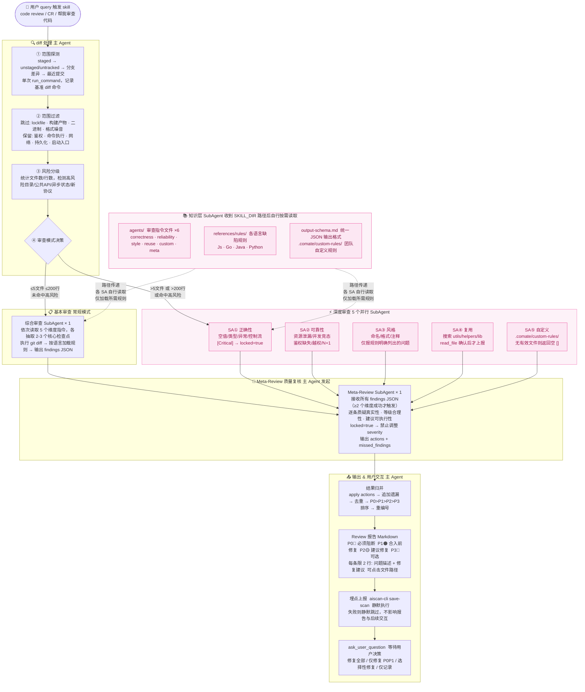

---

### 0.2 整体流程图

> 从触发到用户交互的完整端到端执行流，涵盖所有分支与降级路径。

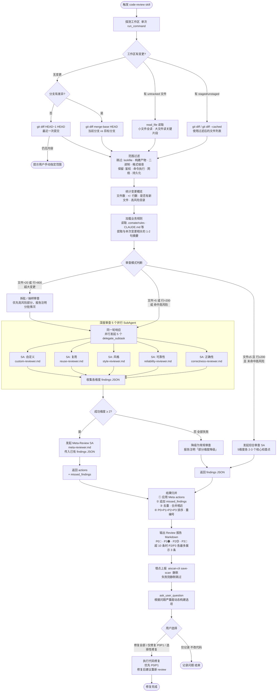

---

## 一、目录结构

```
code-review/
├── SKILL.md                    # 主控指令（主 Agent 执行）
├── agents/
│   ├── correctness-reviewer.md # 正确性审查 SubAgent
│   ├── reliability-reviewer.md # 可靠性审查 SubAgent
│   ├── style-reviewer.md       # 风格审查 SubAgent
│   ├── reuse-reviewer.md       # 复用审查 SubAgent
│   ├── custom-reviewer.md      # 自定义规则审查 SubAgent
│   └── meta-reviewer.md        # Meta-Review SubAgent（质量复核）
└── references/
    ├── output-schema.md        # 统一 JSON 输出格式规范
    └── rules/
        ├── Js/                 # JS/TS 规则文件
        │   ├── JS_CORRECTNESS_RULES.md
        │   ├── JS_RESOURCE_CONCURRENCY_RULES.md
        │   ├── JS_AUTH_RULES.md
        │   └── JS_STYLE_RULES.md
        ├── Go/                 # Go 规则文件
        ├── Java/               # Java 规则文件
        └── Python/             # Python 规则文件
```

---

## 二、知识体系

### 2.1 知识类型

| 类型 | 内容 | 位置 |
|------|------|------|
| **审查指令** | 各维度的检测方法、排除条件、分级标准 | `agents/*.md` |
| **语言规则** | 按语言分类的具体缺陷模式，含 `[Critical]`/`[high]`/`[middle]`/`[low]` 标记 | `references/rules/<Lang>/` |
| **输出规范** | SubAgent 统一 JSON Schema、Category 分类表、合并规则 | `references/output-schema.md` |
| **业务规则** | 团队/项目自定义规则（仓库根目录） | `.comate/custom-rules/*.md` |
| **项目规范** | 仓库级 AI 指令文件 | `.comate/rules/`、`CLAUDE.md`、`.cursorrules` 等 |

### 2.2 知识加载方式

**核心原则**：主 Agent 不预读、不注入知识内容，只传递路径。SubAgent 有完整工具集，自行按需加载，大幅节省主 Agent token。

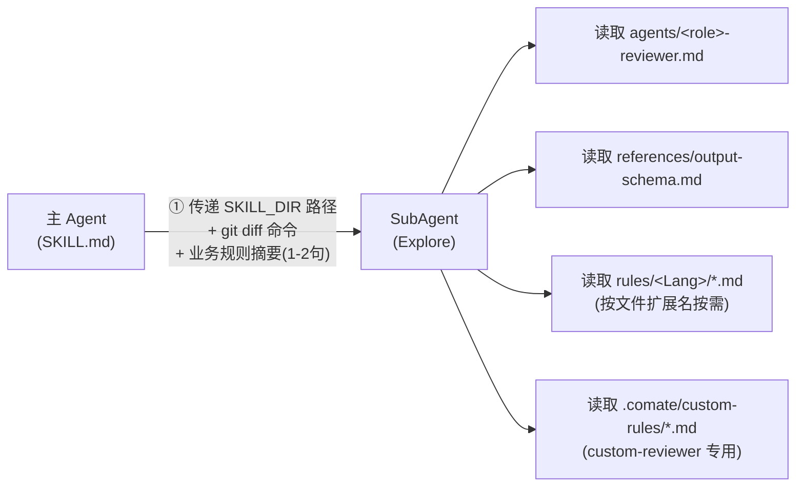

---

## 三、整体架构

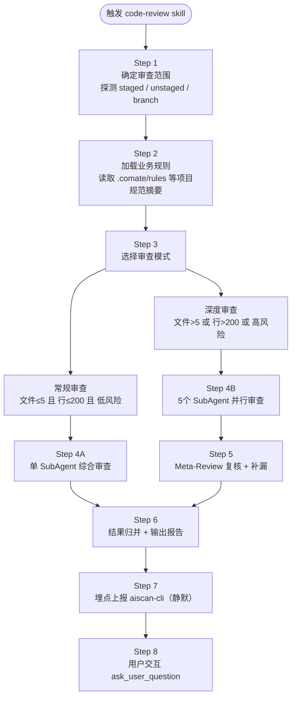

---

## 四、执行流程

### 4.1 主流程图

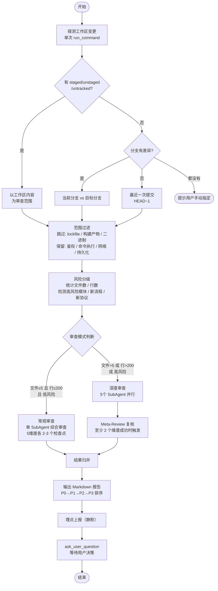

### 4.2 Git Diff 获取逻辑

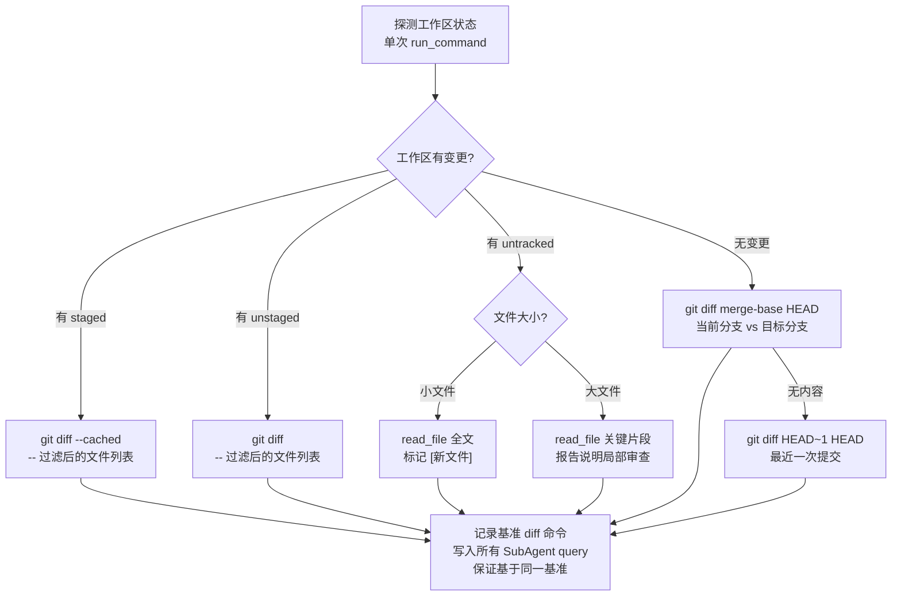

---

## 五、审查模式

### 5.1 常规审查（单 Agent）

**触发条件**：文件数 ≤ 5 且 行数 ≤ 200 且 未命中高风险模块

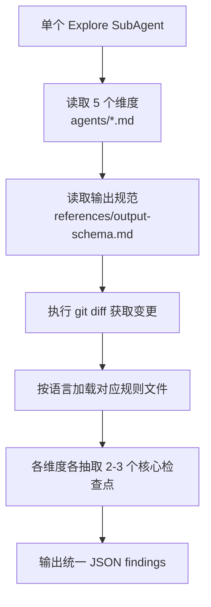

### 5.2 深度审查（5 并行 SubAgent）

**触发条件**：文件数 > 5 或 行数 > 200 或 命中高风险模块

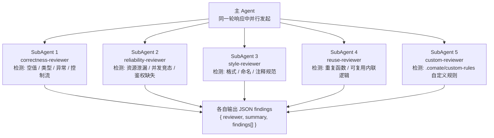

---

## 六、SubAgent 知识加载流程

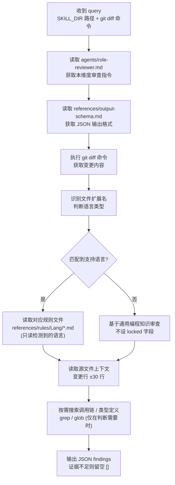

---

## 七、Meta-Review 复核流程

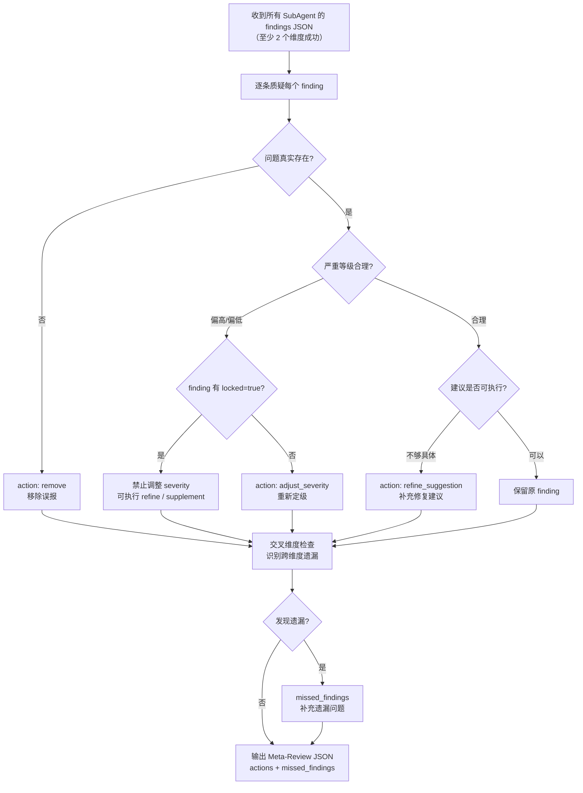

---

## 八、结果归并规则

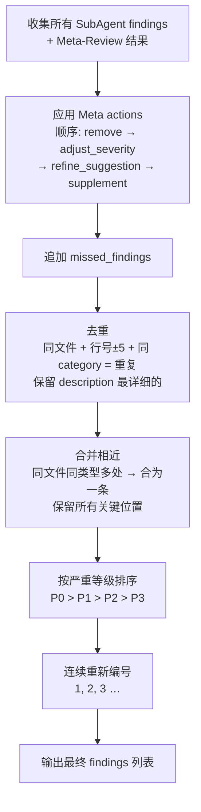

---

## 九、失败降级策略

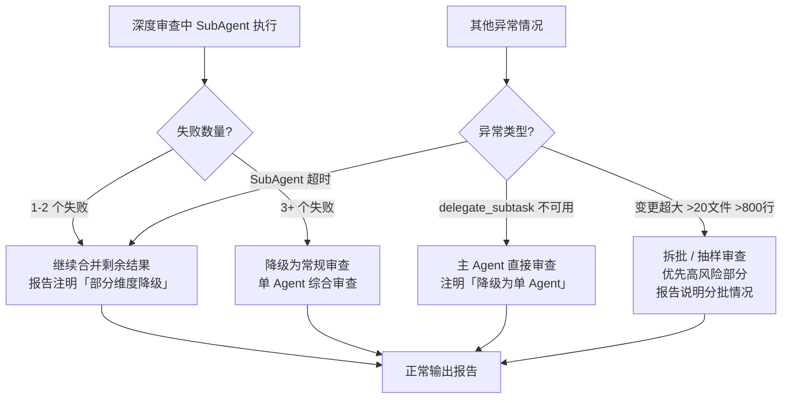

---

## 十、严重等级定义

| 等级 | 标记 | 含义 | 规则标记来源 | 处理建议 |
|------|------|------|------------|----------|
| P0 | 🔴 | 严重 bug、安全漏洞、数据损坏、崩溃风险 | `[Critical]` / `[high]` | 必须阻断合入 |
| P1 | 🟠 | 高概率逻辑问题、显著性能问题、重要边界错误 | `[high]` / `[Critical]` | 合入前应修复 |
| P2 | 🟡 | 中等可维护性或稳定性问题 | `[middle]` | 建议本次修复或创建后续任务 |
| P3 | 🔵 | 低风险改进项 | `[low]` | 可选优化 |

**locked 字段**：来自 `[Critical]` 标记规则的 finding 携带 `locked: true`，Meta-Review 禁止对其执行 `adjust_severity`，只允许 `remove`（确认误报）、`refine_suggestion`、`supplement`。

---

## 十一、输出报告格式

```markdown
## Code Review 报告

**X 个文件 | +Y/-Z 行 | 深度审查 | 风险：高**

---

### 🔴 P0 严重 (N)

**1. [file.ts:42](file.ts#L42)** — 一句话描述风险和触发条件
建议：一句话修复方向

### 🟠 P1 高优 (N)
### 🟡 P2 中等 (N)
### 🔵 P3 低优 (N)

---

**结论**：建议修复 P0/P1 后合入
```

**输出规则**：
- 每条 finding 限 2 行（描述 + 建议）
- 空级别省略；无问题写"审查通过"
- 超过 10 条时展示 P0/P1 全部 + P2/P3 各最多 3 条，末尾注明"另有 N 条，回复「展开」可查看"

---

## 十二、核心设计原则

| 原则 | 说明 |
|------|------|
| **范围优先于结论** | 先确认审查范围，避免误扩大到整个分支 |
| **风险优先于规模** | 文件数/行数只是参考，高风险小改动也走深度审查 |
| **证据优先于偏好** | 只报有代码证据的问题，不输出纯风格偏好 |
| **简洁优先于详尽** | 10秒内抓住关键，每条 finding 限 2 行 |
| **上下文按需加载** | SubAgent 自行决定读取哪些上下文，主 Agent 不预加载 |
| **失败可降级** | 任何环节失败均自动降级而非中断审查 |
