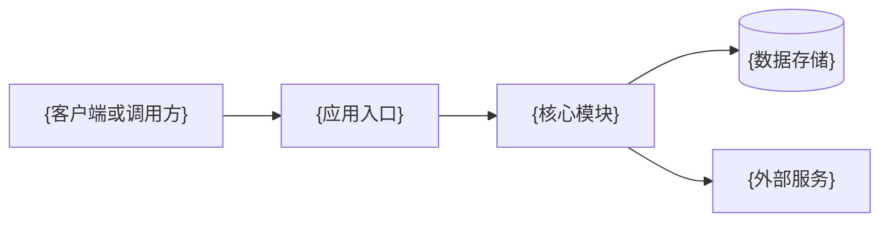

# {Project Name} 架构说明

{简述系统用途、组织方式和主要架构目标。}

本文件仅用来记录系统大方向上的架构设计，记录横跨所有或者绝大部分的模块的约定，单个子包或者模块的架构设计禁止进入此文档。当文件内容和实际架构出现不匹配的情况时修改本文档，同时注意不要附加式的更新，只保留通用的约定，内容过多时注意合并与删减

## 系统地图

- `{客户端或调用方}`：{职责和所在位置。}
- `{应用入口}`：{职责和所在位置。}
- `{核心模块}`：{职责和所在位置。}
- `{数据存储}`：{用途。}
- `{外部服务}`：{用途。}

## 模块边界

- `{模块或包}`：{职责。}
- `{模块或包}`：{职责。}

## 依赖方向

- {说明允许的依赖方向和需要避免的反向依赖。}
- {如为 monorepo，说明包之间的构建或依赖顺序。}