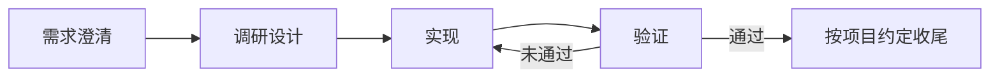

# {Project Name} 研发流程

{简述本项目从需求确认到工作完成的主线。}

## 主线一览

## 阶段说明

1. 需求澄清：{说明输入、验收标准和需要确认的事项。}
2. 调研设计：{说明需要读取的文档、边界和方案要求。}
3. 实现：{说明编码约束和改动原则。}
4. 验证：{说明测试、检查顺序和通过标准。}
5. 收尾：{说明提交、评审或交付方式。}

## 何时停下来

- {需求范围发生变化。}
- {需要执行破坏性或不可逆操作。}
- {缺少必要信息或无法完成验证。}

## 推进范围声明

{Project Name} 默认推进到：

- {例如：完成实现和验证，等待用户决定是否提交。}

<!--
更新此文件时：
- 主线图、阶段说明随实际流程变化而改，流程变了就改节点和箭头，不在旧流程边上追加新流程说明。
- "何时停下来"只保留会改变授权、范围或结果可信度的条件，条件不再成立时删除，不无限累加案例。
- 推进范围声明是当前默认终点的唯一描述，变更时整段替换，不同时保留旧终点和新终点。
-->

