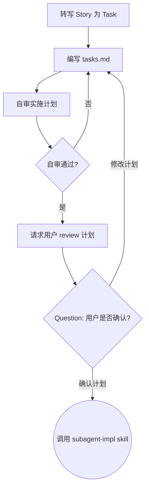

## 目标

基于 `split` 已创建并经用户确认的 Feature / Story，生成可由 `subagent-impl` 执行的 `.comate/specs/{feature_name}/tasks.md`

## 流程

按顺序完成下面流程。本 skill 生成供用户 review 的实施计划，不使用 TodoWrite

1. 转写 Story 为 Task
2. 编写 `tasks.md`
3. 自审实施计划
4. 请求用户 review 计划

### 转写 Story 为 Task

`tasks.md` 只把 Story 转写为可执行契约，不重新拆分任务。

规则：

1. 一个 Story 对应 `tasks.md` 中一个 Task，不得把一个 Story 拆成多个 Task 或者把多个 Story 合并成一个 Task
2. Story 下 Task 卡片只描述 Story 内部步骤，不进入 `tasks.md` 主任务列表
3. 每个 Task 补充目标、上下文、范围、相关文件、验收标准、测试预期和约束

### 编写 `tasks.md`

写入路径：

```text
.comate/specs/{feature_name}/tasks.md
```

每个计划必须以这个头部开始：

```markdown
# [Feature Name] 实施计划

> 面向 agentic workers：REQUIRED SUB-SKILL: 使用 subagent-impl 逐个任务实施此计划。步骤使用 checkbox (`- [ ]`) 语法进行跟踪。

**目标：** [用一句话描述这将构建什么]

**架构：** [用 2-3 句话描述方案；如果没有 doc.md，则基于 split 上下文简述]

**技术栈：** [关键技术/库]

**Feature 卡片：** [Feature 卡片 ID]

**提交绑定策略：** 仅绑定 Story 卡片，不绑定 Feature 或 Story 下 Task

## Story 任务列表

| Task | Story 卡片 | Story 标题 |
| --- | --- | --- |
| Task N | [Story 卡片 ID] | [Story 标题] |
```

每个 Task 使用这个结构：

```markdown
### Task N: [Story 标题]

## 目标
[此任务必须产出的可观察结果]

## 上下文
[此任务如何契合已批准的 doc.md 或 split 上下文]

## iCafe 绑定
- Feature 卡片：[Feature 卡片 ID]
- Story 卡片：[Story 卡片 ID]

## 范围
- 范围内：[此任务可以变更的内容]
- 范围外：[此任务不得执行的相邻工作]

## 相关文件
- 可能修改：`exact/path/to/existing.py`
- 可能创建：`exact/path/to/new_file.py`
- 参考：`exact/path/to/reference.py`

## 验收标准
- [ ] [可观察行为或交付物]
- [ ] [重要边界情况或失败行为]

## 测试预期
- 单元测试：[要覆盖的具体行为]
- 集成/E2E 或运行时验证：[如果可用]
- 命令：`exact command to run`
- 预期结果：[应当通过或可观察到的内容]

## 约束
- [必需的 API、兼容性、依赖、风格或架构约束]
```

### 自审实施计划

`tasks.md` 不得包含占位符或空泛要求。

以下情况属于计划失败：

- `TBD`、`TODO`、`implement later`、`fill in details`
- “Add appropriate error handling” 但没有说明哪些错误重要
- “Write tests” 但没有具体行为、命令和预期结果
- “Similar to Task N” 但没有重复必要上下文
- 引用了任何任务中都未定义的类型、函数或方法

### 请求用户 review 计划

自审通过后，必须使用 question 工具请求用户 review 计划：

```text
计划已完成并保存到 `.comate/specs/{feature_name}/tasks.md`。请您 review，如果需要调整，请告诉我。
```

问题必须包含两个选项：

- 确认计划：调用 `subagent-impl`
- 修改计划：根据用户意见修改 `tasks.md`，并重新自审

## 状态机


