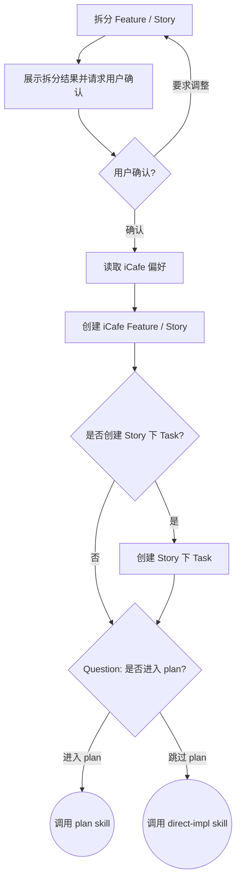

## 目标

将已澄清的需求拆分为 iCafe Feature / Story 卡片，作为百度内部研发活动和提交绑定的承载。

## 流程

按顺序完成下面流程。本 skill 主要创建和确认 iCafe 承载卡片，不使用 TodoWrite

1. 拆分 Feature / Story
2. 展示拆分结果并请求用户确认
3. 读取 iCafe 偏好
4. 创建 iCafe Feature / Story
5. 可选创建 Story 下 Task 卡片

### 拆分 Feature / Story

只创建 1 个 Feature，Feature 描述整体需求；Story 是后续提交绑定单位。

每张 Story 必须满足：

1. 有明确可验收交付物，而不是“开发某模块”这类描述
2. 可独立开发，不依赖其他 Story 的代码才能启动
3. 单一职责，一个端或一条业务链路，不跨端、不跨链路
4. 来自 `think` / `design` 的代码库调研，明确标注改造现有模块或新增模块
5. 标注关注文件与目录，写入 Story 描述

拆分策略：

| 判断条件 | 动作 | 理由 |
| --- | --- | --- |
| 同一业务链路的连续步骤 | 合并 | 保持业务完整，便于验收 |
| 存在代码依赖 | 合并 | 保证可独立开发 |
| 拆分后粒度过小 | 合并 | 避免卡片碎片化 |
| 技术栈不同且可独立交付 | 分开 | 便于并行开发 |
| 跨端，例如前端和服务端 | 分开 | 端是拆分的最小边界 |

标题格式：`【MISSION】【<端名称>】【<模块/服务名>】<功能描述>`

### 展示拆分结果并请求用户确认

创建卡片前必须展示拆分结果，并使用 question 工具等待用户确认

展示格式：

```markdown
需求拆分完成

#### 需求概览
[1-2 句话描述核心目标]

#### 拆分思路
[说明关键的合并/拆分判断；若无特殊决策则省略此节]

#### Feature
| 序号 | 卡片标题 | 卡片内容描述 |
| --- | --- | --- |
| 1 | [Feature 标题] | [整体需求描述] |

#### Story 列表
| 序号 | 端 | 卡片标题 | 卡片内容描述 | 关注文件与目录 | 依赖 |
| --- | --- | --- | --- | --- | --- |
| 1 | 前端 / 服务端 / SDK / 其他 | [Story 标题] | [目标和范围] | [路径列表] | [依赖或无] |
```

若用户选择不调整，直接进行下面读取 icafe 偏好以及创建卡片流程。若用户要求调整时，修改拆分结果并重新展示；用户确认前不要创建卡片。

### 读取 iCafe 偏好

获取当前代码库名称：`basename "$(git rev-parse --show-toplevel)"`。

读取用户偏好文件：`~/.comate/icafe/<repo-name>.json`，不要用 glob 搜索。

如果偏好可用，复用空间、卡片类型、计划、父项目卡片和必填字段；如果偏好不存在或不匹配，调用 `icafe` skill 获取最近访问空间，并使用 question 工具让用户确认。

用户确认空间和卡片类型后，立即保存或更新偏好文件。

### 创建 iCafe 卡片
#### 创建 feature/story 卡片

用户确认拆分结果和 iCafe 空间后，调用 `icafe` 创建卡片，参考 `references/action.md`。

创建规则：

1. 先创建 Feature 父卡片，再创建 Story 子卡片
2. Story 创建时通过 `parent` 同时绑定 Feature，不要创建后再 update 绑定
3. 先创建 Feature / Story；Story 下 Task 卡片仅在用户选择或偏好开启时创建
4. Feature 描述写入需求概述、代码库现状和任务总览
5. Story 描述写入背景、目标、详细说明、关注文件、技术要点和依赖

禁止跳过用户确认直接创建卡片；禁止创建非 Feature 类型父卡片或非 Story 类型子卡片。

#### 创建 Story 下 Task 卡片（可选）

创建 Feature / Story 后，根据用户偏好判断是否创建 Story 下 Task 卡片。

规则：

1. 如果偏好中已配置 `autoSplitTask`，按偏好执行
2. 如果偏好未配置，必须使用 question 工具询问用户是否创建 Story 下 Task 卡片
3. Task 卡片只描述 Story 内部步骤，不作为提交绑定单位
4. 拆分规则：按 Story 工时拆分，默认 1 人日 = 1 个 Task
5. 用户选择后，将 `autoSplitTask` 写入偏好文件
6. 如果用户选择创建，调用 `icafe` 在对应 Story 下创建 Task 卡片
7. Task 创建时必须通过 `parent` 绑定对应 Story，不要创建后再 update 绑定

#### 询问是否进入 `plan`

必须使用 question 工具询问用户是否进入 `plan`，问题必须包含两个选项：

- 进入 `plan`：生成 `tasks.md` 后按计划执行
- 跳过 `plan`：调用 `direct-impl` 直接基于 Story 开始实现

## 状态机


