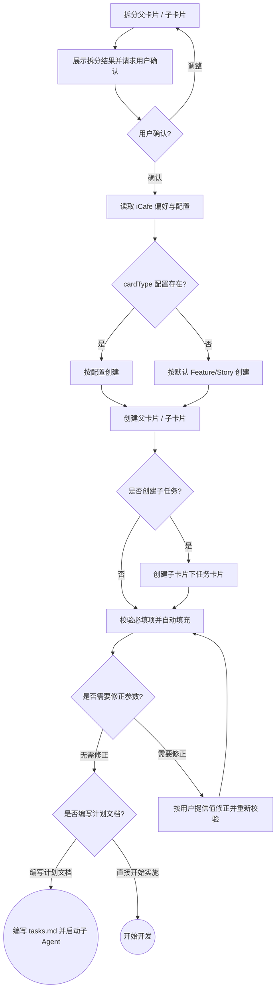

## 目标

将已澄清的需求拆分为 iCafe 卡片，作为百度内部研发活动和提交绑定的承载。

**开始时声明：**“已进入卡片拆分阶段，我会整理父卡片和子卡片，确认后创建 iCafe 卡片。”不得向用户展示 `split` 这一内部 skill 名称。

## 流程

按顺序完成下面流程。本 skill 主要创建和确认 iCafe 承载卡片，不使用 TodoWrite

1. 拆分父卡片 / 子卡片
2. 展示拆分结果并请求用户确认
3. 读取 iCafe 偏好与卡片类型配置
4. 创建 iCafe 父卡片 / 子卡片
5. 校验新建卡片必填项并自动填充，询问用户是否需要修正参数
6. 可选创建子卡片下任务卡片

## 依赖工具集：
> **读取策略（强制）**：对已知路径的文件（如 `docs/icafe.md`、`~/.comate/icafe/<repo-name>.json`），**必须直接使用 Read 工具读取，禁止使用 Glob 判断文件是否存在**。

### 拆分父卡片 / 子卡片

只创建 1 个父卡片，父卡片描述整体需求；子卡片是后续提交绑定单位。

每张子卡片必须满足：

1. 有明确可验收交付物，而不是“开发某模块”这类描述
2. 可独立开发，不依赖其他子卡片的代码才能启动
3. 单一职责，一个端或一条业务链路，不跨端、不跨链路
4. 来自 `think` / `design` 的代码库调研，明确标注改造现有模块或新增模块
5. 标注关注文件与目录，写入子卡片描述

拆分策略：

| 判断条件               | 动作 | 理由                   |
| ---------------------- | ---- | ---------------------- |
| 同一业务链路的连续步骤 | 合并 | 保持业务完整，便于验收 |
| 存在代码依赖           | 合并 | 保证可独立开发         |
| 拆分后粒度过小         | 合并 | 避免卡片碎片化        |
| 技术栈不同且可独立交付 | 分开 | 便于并行开发           |
| 跨端，例如前端和服务端 | 分开 | 端是拆分的最小边界     |

标题格式：`【SDD】【<端名称>】【<模块/服务名>】<功能描述>`

### 读取 iCafe 偏好与卡片类型配置

获取顺序按优先级从高到低，**命中即停止，不再向下读取低优先级来源**：

#### 获取步骤

先运行 `icafe-cli login status`，取返回 JSON 的 `username` 作为 `<icafe-username>`（命令不在 `PATH` 时用 `~/.icafe-cli/bin/icafe-cli login status`）；未登录或取不到用户名时要求用户先完成 iCafe 登录，不要猜测。`<repo-name>` 取当前 git repo 的 basename。

[1] 仓库根目录 `docs/icafe.md`   ← 首选（项目文档，随代码版本管理，最权威）
    │ 存在 → 解析为项目偏好，不再向下读
    │ 不存在 ↓
[2] 项目偏好文件 `~/.comate/icafe/<repo-name>.json` 的 repos.<repo-name> 节点
    │ 存在 → 作为项目偏好
    │ 不存在 ↓
[3] 个人偏好文件 `~/.comate/icafe/<icafe-username>.json` 的 defaults 节点
    │
    └─ 三层均无某字段 → **必须**使用question 询问用户本次取值（`cardType` 除外，读取不到直接使用默认值，不询问）

#### 卡片类型配置（cardType）

`cardType` 规定本 skill 创建的父子卡片类型，格式为 `父类型/子类型/任务类型`（如 `Feature/Story`、`Epic/Story/Task`），可写在 `docs/icafe.md` 的【建卡规则】/【卡片类型】小节，或项目、个人偏好 JSON 的 `cardType` 字段。

按上述优先级从配置读取，**读取不到或解析失败时使用默认值：父卡片=Feature、子卡片=Story、任务卡片=Task，无需询问用户**；部分段缺失时仅对缺失段使用默认值补齐。

#### 字段与 `docs/icafe.md` 小节的对应关系

`docs/icafe.md` 由 `icafe-kno` 沉淀，本 skill 只读取，不重复推导其生成逻辑。命中 [1] 时按下表把小节内容映射为偏好字段：

| 偏好字段        | `docs/icafe.md` 来源                                     |
| --------------- | -------------------------------------------------------- |
| space           | 【空间与层级】的空间 code（多个空间时按层级链与绑定类型匹配，仍无法确定则询问用户）|
| cardType        | 【建卡规则】的父卡片类型 + 需求卡片类型（+ 任务类型）      |
| projectCard     | 【建卡规则】的父卡片ID；为「无」时视为未配置               |
| autoSplitTask   | 【建卡规则】的是否自动拆分任务卡片                         |
| featureRequired | 【必填项】中父类型的字段表                                 |
| storyRequired   | 【必填项】中子类型的字段表                                 |
| 跨空间绑定父卡片 | 【建卡规则】的跨空间绑定父卡片，为「是」时创建子卡片需带 `parentSpacePrefixCode` |

【待确认】小节中的字段视为未配置，按 [2] → [3] 继续回退；`plan` 不在 `docs/icafe.md` 中记录，直接从 [2] / [3] 读取。

#### 合并后最终偏好

| 字段            | 最终值 | 来源                                       |
| --------------- | ------ | ------------------------------------------ |
| space           | <值>   | 项目文档 / 项目偏好 / 个人偏好 / 本次新填 |
| cardType        | <父类型>/<子类型>[/<任务类型>] | 项目文档 / 项目偏好 / 个人偏好 / 默认 Feature/Story |
| plan            | <值>   | 项目偏好 / 个人偏好 / 本次新填              |
| projectCard     | <值>   | 项目文档 / 项目偏好 / 个人偏好 / 本次新填  |
| featureRequired | <值>   | 父卡片必填项列表（项目文档 / 项目偏好 / 个人偏好 / 用户设置）|
| storyRequired   | <值>   | 子卡片必填项列表（项目文档 / 项目偏好 / 个人偏好 / 用户设置）|
| autoSplitTask   | <值>   | 是否继续拆分子卡片为任务卡片，是，则默认直接创建；否，默认不创建；不设置咨询用户|

#### 偏好回写

本次询问或首次填写得到的字段值，立即回写到项目偏好 `~/.comate/icafe/<repo-name>.json` 的 `repos.<repo-name>` 与个人偏好 `~/.comate/icafe/<icafe-username>.json` 的 `defaults`，并更新两边 `updatedAt`；文件不存在时创建完整结构。值未发生变化时不写文件。来自 `docs/icafe.md` 的结论不回写 JSON 偏好，也**不得**由本 skill 修改 `docs/icafe.md`；用户明确提出新的 iCafe 使用习惯时，交由 `icafe-kno` 更新。


### 展示拆分结果和用户偏好结论，并请求用户确认

创建卡片前必须展示拆分结果，展示格式：

```markdown
需求拆分完成

#### 需求概览

[1-2 句话描述核心目标]

#### 拆分思路

[说明关键的合并/拆分判断；若无特殊决策则省略此节]

#### 父卡片

| 序号 | 卡片标题       | 卡片内容描述   |
| ---- | -------------- | -------------- |
| 1    | [父卡片标题]  | [整体需求描述] |

#### 子卡片列表

| 序号 | 端                         | 卡片标题     | 卡片内容描述 | 关注文件与目录 | 依赖       |
| ---- | -------------------------- | ------------ | ------------ | -------------- | ---------- |
| 1    | 前端 / 服务端 / SDK / 其他 | [子卡片标题] | [目标和范围] | [路径列表]     | [依赖或无] |
```
**不得**使用 question 工具等待用户确认
咨询用户：需求任务拆分结果 和 用户偏好，是否需要调整，输入「确认」执行创建卡片操作
若用户选择不调整，直接进行下面读取 icafe 偏好以及创建卡片流程。若用户要求调整时，修改拆分结果并重新展示；用户确认前不要创建卡片。

### 创建 iCafe 卡片

#### 创建父卡片 / 子卡片

用户确认拆分结果和 iCafe 空间后，按「合并后最终偏好」确定的 `cardType` 调用 `icafe` 创建卡片。下文「Feature / Story」即默认类型写法，实际类型以配置为准（读取不到时默认 Feature / Story）。

创建规则：

1. 先创建父卡片，再创建子卡片
2. 子卡片创建时通过 `parent` 同时绑定父卡片（支持跨空间绑定父卡片，相关参数配置 parentSpacePrefixCode），不要创建后再 update 绑定
3. 先创建父 / 子卡片；子卡片下的任务卡片仅在用户选择或偏好开启时创建
4. 父卡片描述写入需求概述、代码库现状和任务总览
5. 子卡片描述写入背景(需求文档链接和引用、依赖)、目标、详细说明、关注文件、技术要点
6. 父 / 子卡片创建时 必须 写入字段：是否Agentic任务=是

禁止跳过用户确认直接创建卡片；禁止创建非 父卡片 类型或非 子卡片 类型的卡片。

#### 创建卡片完成后输出格式

卡片父子关系为：任务卡片 → 子卡片 → 父卡片 → projectCard，即任务卡片的 `parent` 是子卡片，子卡片的 `parent` 是父卡片，父卡片的 `parent` 是 projectCard

输出格式统一为 `[{space}-{sequence}](https://console.cloud.baidu-int.com/devops/icafe/issue/{space}-{sequence}/show)`，样例如下：

```
iCafe 卡片已创建：
## 父卡片: 
DevOps-iScan-38896：【MISSION】AppBuilder 模式

## 子卡片: 
DevOps-iScan-38897：【MISSION】【全栈】【AppBuilder】新增 AppBuilder 模式完整实现
```

若创建了任务卡片，在上述父卡片 / 子卡片行后追加对应任务卡片行。

#### 创建子卡片下的任务卡片（可选）

创建父 / 子卡片后，按「合并后最终偏好」的 `autoSplitTask` 判断是否创建子卡片下任务卡片。

规则：

1. `autoSplitTask` 为是则直接创建，为否则不创建；三层偏好均未配置时，**不得**使用 question 工具询问用户
2. 任务卡片只描述子卡片内部步骤，不作为提交绑定单位
3. 拆分规则：按子卡片工时拆分，默认 1 人日 = 1 个任务卡片
4. 创建时使用 `cardType` 的任务类型段（缺失时默认 Task），并必须通过 `parent` 绑定对应子卡片，不要创建后再 update 绑定
5. 若本次由用户新指定 `autoSplitTask`，按「偏好回写」执行

#### 校验新建卡片必填项与生成测试验证点

创建完父卡片 / 子卡片 / 任务卡片后，对每张新卡片并行执行以下两件事，合并成一轮向用户呈现：

**A. 必填项校验与自动填充**

必须校验每张新卡片的必填项是否填写完整；存在未填写的必填项时自动填充。

**必填字段来源**：即「合并后最终偏好」中的 `featureRequired` / `storyRequired`（任务卡片沿用 `storyRequired`）；命中 `docs/icafe.md` 时，字段名、可选值与约定取值直接取【必填项】小节对应类型的表格，未配置时忽略。

**校验步骤**：

1. 对每张新创建的卡片执行：获取卡片当前字段值
2. 将必填字段清单与卡片当前值比对，汇总缺失的必填字段（空值、空字符串均视为未填写）
3. 对缺失字段按以下优先级自动填充，执行 `icafe-cli card update --space <space> --sequence <sequence> --fields "字段中文名=值"`：
   - `docs/icafe.md`【必填项】表中该字段的「取值」（含取值规则，如 负责人=触发人、所属计划=最新迭代）
   - `type-fields` 返回的 `defaultValue`
   - 负责人 / 经办人字段填充当前触发用户（${COMATE_USERNAME}）
   - `select_list` 字段：仅在 `valueItems` 中能明确取到唯一约定值时填充；无法确定的字段不盲填，返回给用户确认后填充
4. 标注为「待确认」的字段不自动填充，直接列入下方待确认项
5. 自动填充完成后再次 `card get` 复核必填项是否齐全

**B. 生成测试验证点（仅子卡片）**

每张子卡片一起执行：

1. 以该子卡片的标题和描述内容为上下文，调用 `ac-generator` skill 生成功能验证点
2. 将生成的验证点通过 `icafe update-card` 追加到子卡片描述末尾，在【技术要点】之后新增【测试验证点】部分

写入子卡片描述时，【测试验证点】的 HTML 格式为：

```html
<h2>测试验证点</h2>
<ol>
  <li>[验证点1]</li>
  <li>[验证点2]</li>
</ol>
```

**结果呈现与确认（必须执行，A、B 合并展示一次）**：

以表格形式呈现每张卡片的必填项校验/填充结果与测试验证点生成情况，并在表格下方**不得**用 question 工具向用户出示选项「无需修正」或「需要修正参数」：

```markdown
卡片处理完成：

| 卡片 | 缺失必填项 | 自动填充后值 | 待确认项 | 测试验证点 |
| ---- | ---------- | ------------ | -------- | ---------- |
| [space-序号] [卡片标题] | [字段名] | [已填充值；未填写的标注"待确认"] | [无 / 字段名1、字段名2] | [已生成 N 条 / 不适用（父卡片）] |
```

- 用户选择「无需修正」→ 流程结束，进入下一环节
- 用户选择「需要修正参数」→ 根据用户提供的修正值执行，例如 `icafe-cli card update --space joytest --sequence 5528 --fields "父卡片编号=lxdemo-51,负责人=zhangsan,优先级=P1-High"` 更新卡片；如需补充测试验证点，一并通过 `icafe update-card` 更新，重新校验直至确认

#### 父卡片描述模板

创建父卡片时 `description` 字段需为 HTML 格式，将以下 Markdown 模板转换后传入：

```markdown
## 需求概述
[模型对 PRD 的结构化总结，3-5 句话，回答"做什么"和"为什么做"]

## 原始信息来源
- PRD: [知识库链接]
- 补充材料: [其他链接，若有则删除此条]

## 代码库现状

### 技术栈
- 前端: [框架及版本]
- 服务端: [语言 + 框架]
- 数据库: [类型]
- 其他: [如 Redis、Kafka 等；若无则删除此条]

### 模块映射
| 模块 | 路径 | 与需求的关联 | 现状 |
|------|------|-------------|------|
| [模块名] | [路径] | [关联说明] | 已存在，需改造 / 不存在，需新增 |

### 关键发现
- [影响全局实现的重要发现]

### 不确定项
- [需后续确认的事项；若无则删除此节]

## 任务总览
共 N 个子卡片（前端 X 个，服务端 Y 个）
依赖链: [子卡片间的依赖关系描述；若无则写"无"]
```

**数据来源：**

- "需求概述" ← 第一步文档分析结果
- "代码库现状" ← 第二步代码库调研报告（直接搬入）
- "任务总览" ← 拆分结果汇总

#### 子卡片描述模板

创建子卡片时 `description` 字段需为 HTML 格式，将以下 Markdown 模板转换后传入：

```markdown
## 背景

[1-2 句话说明该子卡片在整体需求中的位置]
父需求: [父卡片标题 + iCafe 链接]

## 目标

[该子卡片完成后，用户/系统能做什么，不超过 3 句]

## 详细说明

[具体功能描述、业务规则、边界条件]

## 关注文件与目录

| 路径 | 操作 | 说明 |
|------|------|------|
| [文件/目录路径] | 改造 / 新增 | [具体改动说明] |

## 技术要点

- [该子卡片特有的实现约束或建议]

## 需求验证点

[完成该子卡片后需要注意验证的点]

## 依赖

- 依赖子卡片 [序号] [标题]: [具体依赖什么]
- 外部依赖: [如有]
[若无依赖则删除此节]

## 参考信息

- PRD 相关段落: [父卡片中 PRD 链接 + 章节名]
- 相关文档: [如有 API 文档、设计稿等则列出；若无则删除此条]
```

**数据来源：**

- "关注文件与目录" ← 第二步调研报告的模块映射，按子卡片粒度拆分
- "技术要点" ← 文档分析中与该子卡片相关的技术约束
- "需求验证点" ← 从 `ac-generator` 内获取的知识和当前项目需求推断出来
- "依赖" ← 拆分判断中识别出的依赖关系
- "背景"中的父需求链接 ← 创建父卡片后获得的 iCafe 链接

#### 询问是否编写计划文档

**必须**使用 question 工具询问用户是否编写计划文档。面向用户不得直接使用 `plan`、`direct-impl` 等内部 skill 名称。问题必须包含两个选项：

- 编写计划文档：生成 `tasks.md`，经用户确认后启动子 Agent 逐项实施。选择后内部调用 `plan`
- 直接开始实施：跳过计划文档，直接基于已确认的 Story 开始开发。选择后内部调用 `direct-impl`

## 状态机


```mermaid
flowchart TD
    A[拆分父卡片 / 子卡片] --> B[展示拆分结果并请求用户确认]
    B --> C{用户确认?}
    C -->|调整| A
    C -->|确认| D[读取 iCafe 偏好与配置]
    D --> E{cardType 配置存在?}
    E -->|是| F[按配置创建]
    E -->|否| G[按默认 Feature/Story 创建]
    F --> H[创建父卡片 / 子卡片]
    G --> H
    H --> I{是否创建子任务?}
    I -->|是| J[创建子卡片下任务卡片]
    I -->|否| K[校验必填项并自动填充]
    J --> K
    K --> L{是否需要修正参数?}
    L -->|无需修正| M{是否编写计划文档?}
    L -->|需要修正| N[按用户提供值修正并重新校验]
    N --> K
    M -->|编写计划文档| O((编写 tasks.md 并启动子 Agent))
    M -->|直接开始实施| P((开始开发))
```