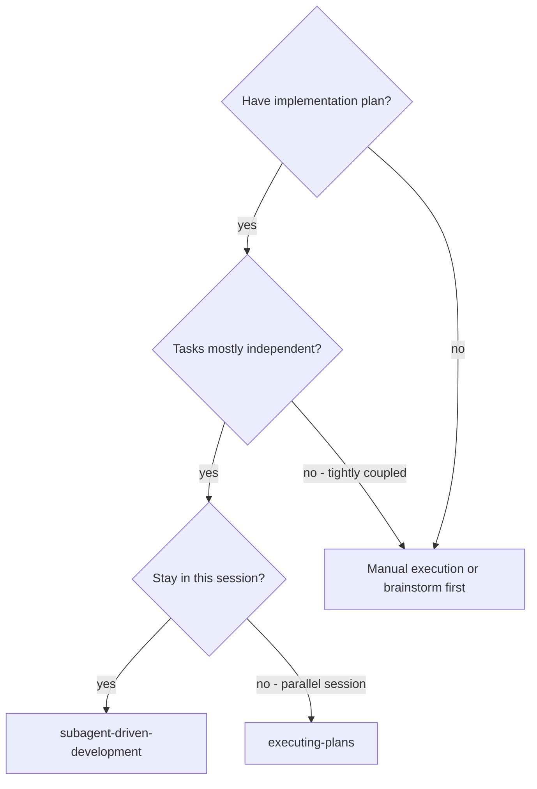
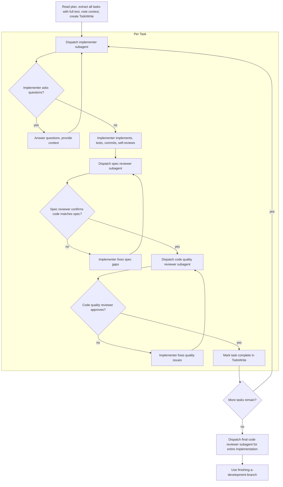

# Subagent-Driven Development

Execute plan by dispatching fresh subagents per task: one implementer, then one spec compliance reviewer, then one code quality reviewer.

**Why subagents:** You delegate tasks to specialized agents with isolated context. By precisely crafting their instructions and context, you ensure they stay focused and succeed at their task. They should never inherit your session's context or history — you construct exactly what they need. This also preserves your own context for coordination work.

**Core principle:** Every task gets exactly this sequence: implementer -> spec compliance reviewer -> code quality reviewer. Spec review must pass before quality review starts.

**Continuous execution:** Do not pause to check in with your human partner between tasks. Execute all tasks from the plan without stopping. The only reasons to stop are: BLOCKED status you cannot resolve, ambiguity that genuinely prevents progress, or all tasks complete. "Should I continue?" prompts and progress summaries waste their time — they asked you to execute the plan, so execute it.

## When to Use




## The Process

For each task, dispatch three separate subagents in order:
1. **Implementer:** implements the task contract, tests, commits, self-reviews, reports status.
2. **Spec compliance reviewer:** verifies the result satisfies the task goal, scope, acceptance criteria, and constraints.
3. **Code quality reviewer:** reviews code quality only after spec compliance passes.

The implementer self-review is not a review stage. The code quality reviewer does not replace the spec compliance reviewer.



## Handling Implementer Status

Implementer subagents report one of four statuses. Handle each appropriately:

**DONE:** Proceed to spec compliance review.

**DONE_WITH_CONCERNS:** The implementer completed the work but flagged doubts. Read the concerns before proceeding. If the concerns are about correctness or scope, address them before review. If they're observations (e.g., "this file is getting large"), note them and proceed to review.

**NEEDS_CONTEXT:** The implementer needs information that wasn't provided. Provide the missing context and re-dispatch.

**BLOCKED:** The implementer cannot complete the task. Assess the blocker:
1. If it's a context problem, provide more context and re-dispatch
2. If the task is too large, break it into smaller pieces
3. If the plan itself is wrong, escalate to the human

**Never** ignore an escalation or force the subagent to retry without changes. If the implementer said it's stuck, something needs to change.

## Prompt Templates

- `./implementer-prompt.md` - Dispatch implementer subagent
- `./spec-reviewer-prompt.md` - Dispatch spec compliance reviewer subagent
- `./code-quality-reviewer-prompt.md` - Dispatch code quality reviewer subagent

## Example Workflow

```
You: I'm using Subagent-Driven Development to execute this plan.

[Read plan once: .comate/specs/{feature_name}/tasks.md]
[Extract every task with goal, scope, context, files, acceptance criteria, constraints, and verification]
[Create TodoWrite with all tasks]

Task 1: [Task title]

[Dispatch implementer subagent with Task 1 text + relevant spec context]
Implementer: DONE / DONE_WITH_CONCERNS / NEEDS_CONTEXT / BLOCKED

If NEEDS_CONTEXT: provide context and re-dispatch
If BLOCKED: resolve blocker, split task, or escalate to human
If DONE_WITH_CONCERNS: read concerns before review

If DONE or concerns resolved:
[Dispatch spec compliance reviewer]
If spec reviewer finds issues: return issues to implementer, then re-run spec review

After spec approval:
[Dispatch code quality reviewer]
If code quality reviewer finds issues: return issues to implementer, then re-run code quality review

[Mark Task 1 complete only after both reviews approve]

...

[After all tasks]
[Dispatch final code reviewer for entire implementation]
[Use finishing-a-development-branch]
```

## Red Flags

Never:
- Start implementation on main/master branch without explicit user consent
- Dispatch multiple implementation subagents in parallel for tasks that can touch the same files
- Make subagents read the whole plan or spec themselves; provide the exact task text and relevant context
- Skip scene-setting context; the subagent needs to know where the task fits
- Ignore subagent questions, concerns, `NEEDS_CONTEXT`, or `BLOCKED`
- Let implementer self-review replace spec compliance or code quality review
- Skip either review stage, or run code quality review before spec compliance passes
- Treat "close enough" as approved; every reviewer issue must be fixed and re-reviewed
- Move to the next task while any implementer concern or reviewer issue remains unresolved
- Fix manually in the controller session when a subagent should receive focused instructions

## Integration

**Required workflow skills:**
- **using-git-worktrees** - Ensures isolated workspace (creates one or verifies existing)
- **writing-plans** - Creates the plan this skill executes
- **requesting-code-review** - Code review template for reviewer subagents
- **finishing-a-development-branch** - Complete development after all tasks
