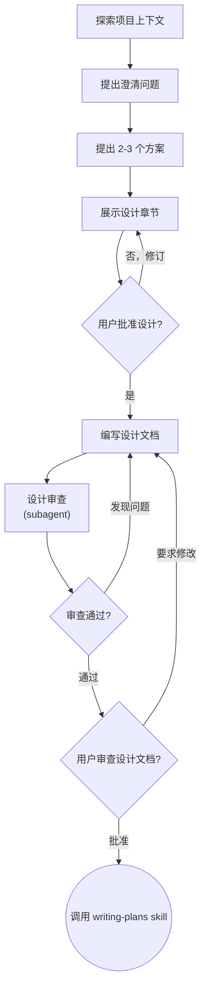

## 目标

通过对话帮助用户把想法转化为完整的设计文档。流程如下：

1. 理解当前项目上下文
2. 提出澄清问题来细化想法
3. 理解要构建的内容后，展示设计请求用户审阅和批准

> [!IMPORTANT]
> 无论项目看起来多简单，在你展示设计并获得用户批准之前，不要调用任何实现类 skill 或者编写代码。
> 每个项目都要经过这个流程，简单项目最容易因为未经检查的假设而浪费用户精力。设计可以很短（真正简单的项目用几句话即可），但你必须展示它并获得批准。

## 流程

### Checklist

你**必须**使用 TodoWrite 工具为下面所有的列表项创建一个 TODO 条目，并按顺序完成：

1. 探索项目上下文
2. 提出澄清问题
3. 提出 2-3 个方案
4. 展示设计
5. 编写设计文档
6. 设计审查
7. 用户审查已写好的 `doc.md`
8. 过渡到实现

### 详细流程

#### 探索项目上下文

- 先检查当前项目状态（文件、文档、最近提交）
- 聚焦理解目的、约束和成功标准

#### 提出澄清问题

- **必须**使用 question 工具提问，将独立问题合并到一条消息中；只有当后续问题依赖先前答案时才拆成多轮提问。

#### 提出 2-3 个方案

- **必须**使用 question 工具提问，每个问题都要包含你的推荐项，每个问题的条目都要包含为什么给出该选项的权衡，等待用户选择或者修正。

#### 展示设计

- 按复杂度分章节展示，每节后请求用户审阅和批准
- 当你认为已理解要构建的内容后，展示设计
- 每个章节按复杂度调整长度：简单时几句话即可，复杂时最多 200-300 词
- 每节后询问到目前为止是否正确
- 覆盖架构、组件、数据流、错误处理和测试
- 如果某些内容不清楚，准备返回并继续澄清

#### 编写设计文档

- 保存到 `.comate/specs/{feature_name}/doc.md` 并提交
- 将已验证的设计写入 `.comate/specs/{feature_name}/doc.md`
- 将设计文档提交到 git

#### 设计审查

- 派发 subagent 审查占位符、矛盾、歧义和范围
- 写完设计文档后，使用 `design-document-reviewer-prompt.md` 中的提示词模板派发 subagent 审查。subagent 检查：
  1. **占位符扫描：** 是否存在 “TBD”、“TODO”、不完整章节或含糊需求？
  2. **内部一致性：** 各章节是否互相矛盾？架构是否匹配功能描述？
  3. **范围检查：** 是否足够聚焦，能形成单个实现计划，还是需要拆解？
  4. **歧义检查：** 是否有需求可能被解释成两种不同含义？
- 如果 subagent 返回问题，直接修复并重新派发审查，直到通过。

#### 用户审查已写好的 `doc.md`

- 在继续前请用户审查 `doc.md` 文件
- agent 进行完设计文档审查循环后，请用户在继续前进行审查：
  > “设计文档已编写并提交至 `.comate/specs/{feature_name}/doc.md`。请您审阅，如果您想进行任何更改，请告诉我。”
- 等待用户回复。如果用户要求修改，进行修改并重新运行审查循环。只有用户批准后才能继续。

#### 过渡到实现

调用 `writing-plans` skill 创建详细实现计划。不要调用任何其他 skill

### 状态机

**终止状态是调用 writing-plans。** 不要调用 `frontend-design`、`mcp-builder` 或任何其他实现类 skill。`think-and-design` 后唯一调用的 skill 是 `writing-plans`。

## 设计要点

**为隔离性和清晰性设计：**

- 将系统拆分为更小的单元，每个单元有明确目的，通过定义良好的接口通信，并且可以独立理解和测试
- 对每个单元，你都应该能回答：它做什么、如何使用它、它依赖什么？
- 别人能否不读内部实现就理解一个单元的作用？你能否修改内部实现而不破坏使用方？如果不能，边界需要调整。
- 更小且边界清晰的单元也更容易操作。你更擅长处理能一次装入上下文的代码；当文件职责单一且精确时，修改更可靠。文件变大通常意味着它承担了太多职责。

**在现有代码库中工作：**

- 提出变更前先探索当前结构。遵循现有模式。
- 如果现有代码存在影响当前工作的缺陷（例如文件过大、边界不清、职责纠缠），将有针对性的改进纳入设计，就像优秀开发者会改进自己正在处理的代码一样。
- 不要提出无关重构。只关注服务当前目标的内容。

## 关键原则

- **优先使用 question 工具**：该方式比开放式问题更容易回答
- **合并独立问题**：将没有依赖关系的问题合并到一条消息中；只有答案真正阻塞后续问题时才拆轮次
- **严格 YAGNI**：从所有设计中移除不必要功能
- **探索替代方案**：在确定方案前始终提出 2-3 个方案
- **增量验证**：展示设计并获得批准后再继续
- **保持灵活**：当某些内容不合理时，返回并澄清
