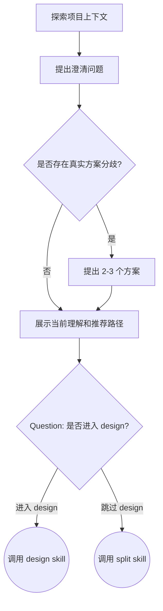

## 目标

通过对话帮助用户把原始想法收敛为可以进入研发流程的清晰需求

## 流程

按顺序完成下面流程。本 skill 只做需求澄清和流程分流，不使用 TodoWrite

1. 探索项目上下文
2. 提出澄清问题
3. 提出 2-3 个方案
4. 展示当前理解和推荐路径

### 探索项目上下文

- 先检查当前项目状态（文件、文档、最近提交）
- 只做足够支撑需求理解的调研，不进行完整架构设计
- 如果用户提供 PRD、URL、本地文档或 iCafe 卡片，**必须**先使用子 agent 提炼其中和本次变更直接相关的信息
- 外部材料提炼应按文档类型自适应，不要求固定模板；必须保留原始来源，并提取足以支撑需求理解的关键信息。材料中明确存在的目标、功能模块、业务规则、边界条件、涉及端、不确定项等内容应优先提取；不存在时不要编造

### 澄清问题

- **必须**使用 question 工具，避免开放式长问题，同时合并互不依赖的问题，减少来回轮次
- 只询问会影响需求理解、方案选择或拆卡边界的问题
- 如果仍存在会影响需求理解、方案选择或拆卡边界的不确定项，必须继续澄清，不要进入展示当前理解

### 方案选择

- 只有存在真实选择时才提出 2-3 个方案
- 不要为了满足形式而编造方案
- 方案说明保持简短，重点说明用户需要选择的差异和代价

### 展示当前理解

当你认为需求已经足够清楚时，展示一段轻量确认，不要写成长文档。

展示当前理解后，**必须**使用 question 工具询问用户是否进入 `design`。问题必须包含两个选项：

- 进入 `design`：先编写设计文档，再进入 `split`
- 跳过 `design`：直接进入 `split`

## 状态机

