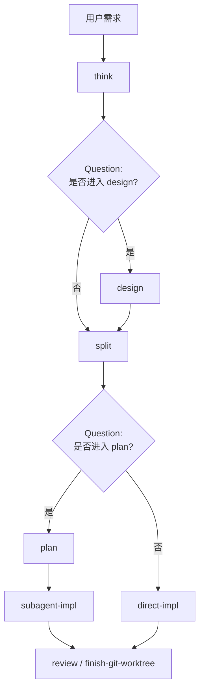

## Skills 使用规则

**在任何回复或行动之前调用相关或被请求的 skills。** 哪怕只有 1% 的可能性适用，也意味着你应该调用 skill 来确认。如果发现调用后的 skill 不适合当前情况，你可以不使用它。

> [!IMPORTANT]
>
> - **不要**因为用户给出的是一个简单任务就放弃调用 skill
> - 同理，你如果想探索代码库，也必须按照 skill 的指示去探索，skill 会教你如何收集信息，而不是直接去派发子 agent

### Skill 优先级

当多个 skills 都可能适用时，按以下顺序使用：

1. **流程类 skills 优先**（think、debug）：它们决定如何处理任务
2. **研发承载类 skills 其次**（split）：它们创建或确认研发卡片
3. **可选增强类 skills 再次**（design、plan）：它们只在用户选择后使用
4. **实现类 skills 最后**（create-skill、create-rule）：它们指导执行

“帮我增加 xxx 功能” → 先 think，再 split，再进入实现。
“修复 xxx bug” → 先 debug，再使用领域特定 skills。

### Mission Flow 主流程

对会产生代码变更的厂内研发活动，主流程是：



- `think` 是必选步骤：澄清需求、调研必要上下文，并展示当前理解
- `design` 是可选步骤：只在用户选择后编写设计文档
- `split` 是必选步骤：创建或确认 iCafe Feature / Story 卡片，作为研发活动和提交绑定的承载
- `plan` 是可选步骤：只在用户选择后编写实施计划

## Question 工具使用规则

Skill 要求使用 Question 工具的时候则必须使用，不能推辞。该工具能有效减轻用户负担，提升研发效率

question 工具标题和每个子项内容都要精炼，并按以下格式组织：

```text
标题：[精炼问题标题]

选项：
1. [简要标题]（推荐） description: [推荐原因，以及选择后的影响]
2. [简要标题] description: [选择后的影响或代价]
3. [简要标题] description: [选择后的影响或代价]
```

## 编码及语言规则

1. **禁止使用破折号。**请使用逗号、句号和冒号。（此条为硬性规定，因回复中常出现此模式，故着重强调）
2. 回复用户的语言必须是用户发送语言（若多种语言混杂则选择中文回复）
3. 未经用户同意在 icode 上 push 或提交 cr，若用户同意提交 cr，必须提交到 `@{upstream}`，因为我们的开发分支没有对应的远程分支，格式类似于
   ```bash
   git push origin HEAD:refs/for/release-20260615 # 这里的 release-20260615 使用 fork 前的基础分支 `@{upstream}` 替换
   ```
