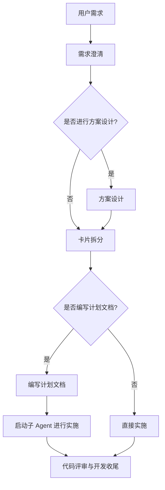

## Skills 使用规则

**在任何回复或行动之前调用相关或被请求的 skills。** 哪怕只有 1% 的可能性适用，也意味着你应该调用 skill 来确认。如果发现调用后的 skill 不适合当前情况，你可以不使用它。

> [!IMPORTANT]
>
> - **不要**因为用户给出的是一个简单任务就放弃调用 skill
> - 同理，你如果想探索代码库，也必须按照 skill 的指示去探索，skill 会教你如何收集信息，而不是直接去派发子 agent

### Skill 优先级

当多个 skills 都可能适用时，按以下顺序使用：

1. **流程类 skills 优先**（think、debug）：它们决定如何处理任务
2. **研发承载类 skills 其次**（split）：它们创建或确认研发卡片
3. **可选增强类 skills 再次**（design、plan）：它们只在用户选择后使用
4. **实现类 skills 最后**（create-skill、create-rule）：它们指导执行

“帮我增加 xxx 功能” → 先 think，再 split，再进入实现。
“修复 xxx bug” → 先 debug，再使用领域特定 skills。

### Mission Flow 主流程

对会产生代码变更的厂内研发活动，主流程是：

面向用户展示流程时，必须使用中文阶段名称。英文 skill 名称只用于内部调用、配置和维护，不得把“进入 design”“执行 split”这类内部术语直接作为用户选项或进度提示。

| 内部 skill            | 用户展示名称          | 用户可理解的动作                  |
| --------------------- | --------------------- | --------------------------------- |
| `think`               | 需求澄清              | 理解需求、调研上下文、确认范围    |
| `design`              | 方案设计              | 编写并评审设计文档                |
| `split`               | 卡片拆分              | 创建 iCafe Feature 和 Story       |
| `plan`                | 编写计划文档          | 把 Story 转成可执行计划文档       |
| `direct-impl`         | 直接实施              | 跳过计划文档，依据 Story 开始开发 |
| `subagent-impl`       | 启动子 Agent 进行实施 | 派发子 Agent 逐项开发和评审       |
| `finish-git-worktree` | 开发收尾              | 验证结果并处理分支和工作区        |


```mermaid
flowchart TD
    A[用户需求] --> T[需求澄清]
    T --> QD{是否进行方案设计?}
    QD -->|是| D[方案设计]
    QD -->|否| S[卡片拆分]
    D --> S
    S --> QP{是否编写计划文档?}
    QP -->|是| P[编写计划文档]
    QP -->|否| I[直接实施]
    P --> E[启动子 Agent 进行实施]
    E --> R[代码评审与开发收尾]
    I --> R
```

- 需求澄清（内部 skill：`think`）是必选步骤：澄清需求、调研必要上下文，并展示当前理解
- 方案设计（内部 skill：`design`）是可选步骤：只在用户选择后编写设计文档
- 卡片拆分（内部 skill：`split`）是必选步骤：创建或确认 iCafe Feature / Story 卡片，作为研发活动和提交绑定的承载
- 编写计划文档（内部 skill：`plan`）是可选步骤：只在用户选择后生成可审阅、可执行的文档

## Question 工具使用规则

Skill 要求使用 Question 工具的时候则必须使用，不能推辞。该工具能有效减轻用户负担，提升研发效率

question 工具标题和每个子项内容都要精炼，并按以下格式组织：

```text
标题：[精炼问题标题]

选项：
1. [简要标题]（推荐） description: [推荐原因，以及选择后的影响]
2. [简要标题] description: [选择后的影响或代价]
3. [简要标题] description: [选择后的影响或代价]
```

阶段选择问题的标题、选项和 description 必须使用上表中的中文展示名称，并说明将执行的动作或生成的产物。不得要求用户理解英文 skill 名称。

## 编码及语言规则

1. **禁止使用破折号。** 请使用逗号、句号和冒号。（此条为硬性规定，因回复中常出现此模式，故着重强调）
2. 回复用户的语言必须是用户发送语言（若多种语言混杂则选择中文回复）
3. 未经用户同意在 icode 上 push 或提交 cr，若用户同意提交 cr，必须提交到 `@{upstream}`，因为我们的开发分支没有对应的远程分支，格式类似于
   ```bash
   git push origin HEAD:refs/for/release-20260615 # 这里的 release-20260615 使用 fork 前的基础分支 `@{upstream}` 替换
   ```
